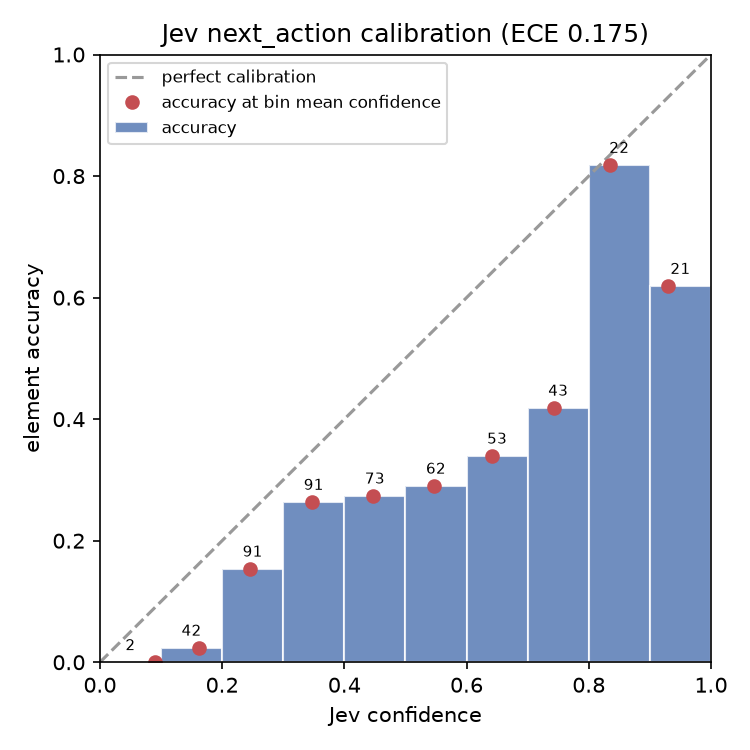
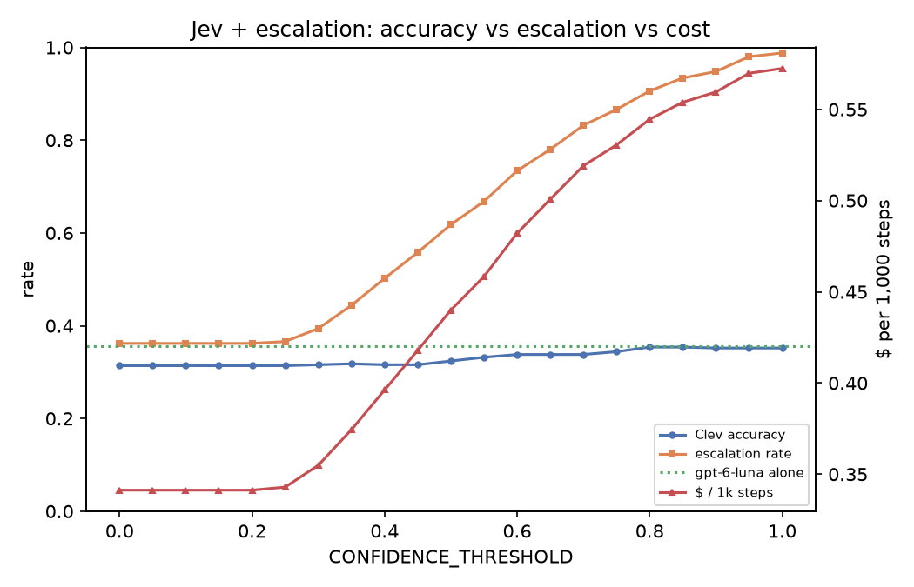

# Mind2Web step-level eval (500 steps)

Steps sampled evenly from the first shard of each official test split (task / website / domain), 57 websites, 134 tasks. Every decider sees the same Clev pipeline output (observer -> filter -> rank -> 200 options), so only the decider differs.

## Headline

| Decider | Element acc | strict | answerable | Action acc | Escalated | Median ms | p95 ms | $ / 1k steps | Errors |
|---|---|---|---|---|---|---|---|---|---|
| **Clev** (Jev + gpt-6-luna @ 0.6) | 33.8% | 31.4% | 40.0% | 32.2% | 73% | 2,509 | 4,575 | $0.482 | 0 |
| Jev alone | 28.8% | 26.8% | 34.0% | 27.8% | – | 396 | 508 | $0.211 | 0 |
| gpt-6-luna alone (LLM-only baseline) | 35.6% | 32.8% | 42.1% | 34.0% | – | 2,437 | 4,218 | $0.367 | 0 |

- **Element acc**: chose the target element or one that clicks the same thing (its label, or a link wrapping it). **strict**: exact Mind2Web element. **answerable**: only steps whose target exists in Mind2Web's saved HTML. **Action acc**: right element and right verb (TYPE -> type; CLICK/SELECT/HOVER -> click). Typed values aren't scored.
- Latency is per decision (network included), cost is per step, both from real API usage.

## Live-style: planner writes the next subgoal, then the decider picks

Mind2Web gives the decider the whole task, so above it must plan *and* pick. Live Clev splits those: the planner writes short subgoals and Jev picks elements. Here the real planner (`LLMPlanner.replan`, gpt-6-luna) writes each step's next subgoal from the task, past actions and page; every decider gets the same subgoal. Latency and cost include that planner call (live Clev plans once per task, so this overstates both).

| Decider | Element acc | strict | answerable | Action acc | Escalated | Median ms | p95 ms | $ / 1k steps | Errors |
|---|---|---|---|---|---|---|---|---|---|
| **Clev + planner** (Jev + gpt-6-luna @ 0.6) | 35.0% | 32.6% | 41.4% | 33.2% | 39% | 3,498 | 7,021 | $0.492 | 1 |
| jev + planner | 32.6% | 31.0% | 38.5% | 31.2% | – | 2,709 | 4,995 | $0.353 | 0 |
| gpt-6-luna + planner | 36.2% | 34.0% | 42.8% | 34.4% | – | 4,605 | 7,096 | $0.493 | 1 |

Jev calibration with planner subgoals: ECE 0.363.

Example subgoals:
- *Get quotes for a 10lbs package Long Beach to Portland* -> "Select the Portland, OR, USA suggestion for the destination."
- *Find the best baby registry for the first breastfed girl child, and get me all the choices* -> "Click "NEXT" to continue from the quiz preferences."
- *Buy a diamond pass in New York's, Great escape park, add one meal dining plan to it, and s* -> "Click the “Diamond Pass” link to begin purchasing the pass."
- *search for senior housing in Boston, MA with two bathrooms and with a virtual tour.* -> "Set the bathroom filter to two bathrooms."
- *Open the reviews of a recipe with beef sirloin.* -> "Click "Close this dialog window" to dismiss the dialog."

## Pipeline ceiling (before any decider)

| Stage | Steps | Share |
|---|---|---|
| Target exists in Mind2Web's saved HTML | 423 | 84.6% |
| Observer sees it (or an equivalent element) | 380 | 76.0% |
| Target among the 200 options | 353 | 70.6% |

Serialized state size: median 3,001 tokens, max 6,918 (budget 24,000).

## Calibration of Jev's next_action confidence (ECE 0.175)

| Confidence | Steps | Mean confidence | Accuracy |
|---|---|---|---|
| 0.0–0.1 | 2 | 0.09 | 0.0% |
| 0.1–0.2 | 42 | 0.16 | 2.4% |
| 0.2–0.3 | 91 | 0.25 | 15.4% |
| 0.3–0.4 | 91 | 0.35 | 26.4% |
| 0.4–0.5 | 73 | 0.45 | 27.4% |
| 0.5–0.6 | 62 | 0.55 | 29.0% |
| 0.6–0.7 | 53 | 0.64 | 34.0% |
| 0.7–0.8 | 43 | 0.74 | 41.9% |
| 0.8–0.9 | 22 | 0.83 | 81.8% |
| 0.9–1.0 | 21 | 0.93 | 61.9% |

## CONFIDENCE_THRESHOLD sweep (Jev + escalation, simulated from recorded answers)

| Threshold | Accuracy | Escalated | $ / 1k steps | Median ms |
|---|---|---|---|---|
| 0.00 | 31.4% | 36% | $0.341 | 434 |
| 0.10 | 31.4% | 36% | $0.341 | 434 |
| 0.20 | 31.4% | 36% | $0.341 | 434 |
| 0.30 | 31.6% | 39% | $0.355 | 446 |
| 0.40 | 31.6% | 50% | $0.396 | 1,767 |
| 0.50 | 32.4% | 62% | $0.440 | 2,325 |
| 0.60 | 33.8% | 73% | $0.482 | 2,509 |
| 0.70 | 33.8% | 83% | $0.519 | 2,677 |
| 0.80 | 35.4% | 91% | $0.545 | 2,779 |
| 0.90 | 35.2% | 95% | $0.560 | 2,806 |
| 1.00 | 35.2% | 99% | $0.572 | 2,835 |
