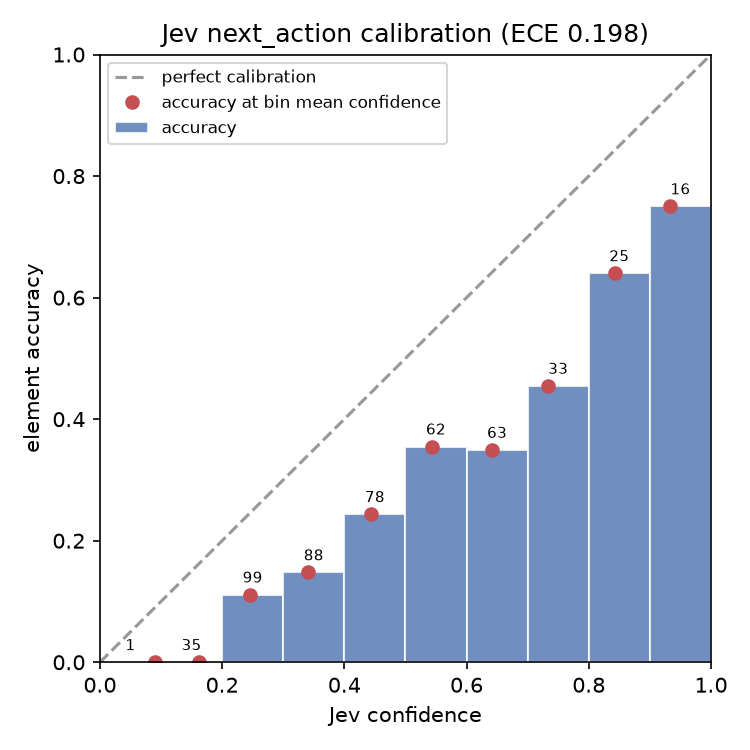
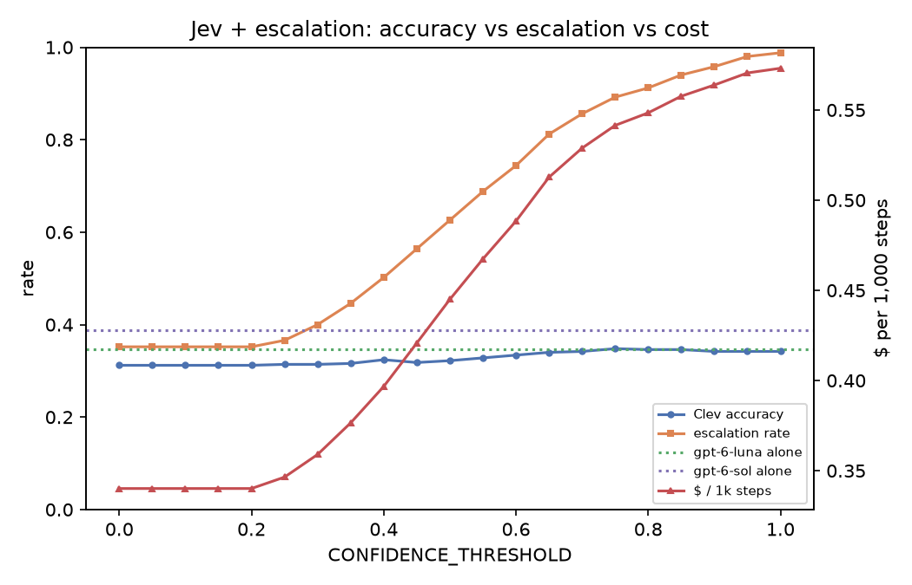

# Mind2Web step-level eval (500 steps)

Steps sampled evenly from the first shard of each official test split (task / website / domain), 57 websites, 134 tasks. Every decider sees the same Clev pipeline output (observer -> filter -> rank -> 200 options), so only the decider differs.

## Headline

| Decider | Element acc | strict | answerable | Action acc | Escalated | Median ms | p95 ms | $ / 1k steps | Errors |
|---|---|---|---|---|---|---|---|---|---|
| **Clev** (Jev + gpt-6-luna @ 0.6) | 33.4% | 31.2% | 39.5% | 32.0% | 74% | 2,857 | 13,314 | $0.488 | 0 |
| Jev alone | 26.0% | 24.6% | 30.7% | 25.2% | – | 395 | 566 | $0.210 | 0 |
| gpt-6-luna alone (LLM-only baseline) | 34.6% | 32.2% | 40.9% | 33.4% | – | 2,761 | 13,285 | $0.368 | 0 |
| gpt-6-sol alone (LLM-only baseline) | 38.8% | 36.0% | 45.9% | 37.4% | – | 3,426 | 11,964 | $7.012 | 0 |

- **Element acc**: chose the target element or one that clicks the same thing (its label, or a link wrapping it). **strict**: exact Mind2Web element. **answerable**: only steps whose target exists in Mind2Web's saved HTML. **Action acc**: right element and right verb (TYPE -> type; CLICK/SELECT/HOVER -> click). Typed values aren't scored.
- Latency is per decision (network included), cost is per step, both from real API usage.

## Live-style: planner writes the next subgoal, then the decider picks

Mind2Web gives the decider the whole task, so above it must plan *and* pick. Live Clev splits those: the planner writes short subgoals and Jev picks elements. Here the real planner (`LLMPlanner.replan`, gpt-6-luna) writes each step's next subgoal from the task, past actions and page; every decider gets the same subgoal. Latency and cost include that planner call (live Clev plans once per task, so this overstates both).

| Decider | Element acc | strict | answerable | Action acc | Escalated | Median ms | p95 ms | $ / 1k steps | Errors |
|---|---|---|---|---|---|---|---|---|---|
| **Clev + planner** (Jev + gpt-6-luna @ 0.6) | 20.8% | 19.4% | 24.6% | 19.8% | 41% | 4,221 | 16,985 | $0.473 | 0 |
| jev + planner | 20.2% | 18.6% | 23.9% | 19.4% | – | 3,263 | 11,153 | $0.333 | 0 |
| gpt-6-luna + planner | 21.0% | 19.8% | 24.8% | 20.0% | – | 5,233 | 64,806 | $0.473 | 0 |

Jev calibration with planner subgoals: ECE 0.464.

Example subgoals:
- *Get quotes for a 10lbs package Long Beach to Portland* -> "Select the Portland destination suggestion from the autocomplete list."
- *Find the best baby registry for the first breastfed girl child, and get me all the choices* -> "Click the "Registry Builder" link to continue the quiz and view recommendations."
- *Buy a diamond pass in New York's, Great escape park, add one meal dining plan to it, and s* -> "Click the “Tickets” link to return to the pass purchase flow."
- *search for senior housing in Boston, MA with two bathrooms and with a virtual tour.* -> "Open the search filters and set the bathroom count to "2 bathrooms"."
- *Open the reviews of a recipe with beef sirloin.* -> "[link] Beef -> CLICK"

## Pipeline ceiling (before any decider)

| Stage | Steps | Share |
|---|---|---|
| Target exists in Mind2Web's saved HTML | 423 | 84.6% |
| Observer sees it (or an equivalent element) | 380 | 76.0% |
| Target among the 50 options | 232 | 46.4% |
| Target among the 100 options | 286 | 57.2% |
| Target among the 200 options | 334 | 66.8% |

Serialized state size: median 3,000 tokens, max 6,938 (budget 24,000).

## Jev by option count

| Decider | Element acc | strict | answerable | Action acc | Escalated | Median ms | p95 ms | $ / 1k steps | Errors |
|---|---|---|---|---|---|---|---|---|---|
| Jev alone, 50 options | 21.0% | 19.4% | 24.8% | 20.0% | – | 376 | 495 | $0.089 | 0 |
| Jev alone, 100 options | 25.2% | 23.6% | 29.8% | 24.0% | – | 379 | 466 | $0.136 | 0 |
| Jev alone, 200 options | 26.0% | 24.6% | 30.7% | 25.2% | – | 395 | 566 | $0.210 | 0 |

## Calibration of Jev's next_action confidence (ECE 0.198)

| Confidence | Steps | Mean confidence | Accuracy |
|---|---|---|---|
| 0.0–0.1 | 1 | 0.09 | 0.0% |
| 0.1–0.2 | 35 | 0.16 | 0.0% |
| 0.2–0.3 | 99 | 0.25 | 11.1% |
| 0.3–0.4 | 88 | 0.34 | 14.8% |
| 0.4–0.5 | 78 | 0.44 | 24.4% |
| 0.5–0.6 | 62 | 0.54 | 35.5% |
| 0.6–0.7 | 63 | 0.64 | 34.9% |
| 0.7–0.8 | 33 | 0.73 | 45.5% |
| 0.8–0.9 | 25 | 0.84 | 64.0% |
| 0.9–1.0 | 16 | 0.93 | 75.0% |

## CONFIDENCE_THRESHOLD sweep (Jev + escalation, simulated from recorded answers)

| Threshold | Accuracy | Escalated | $ / 1k steps | Median ms |
|---|---|---|---|---|
| 0.00 | 31.2% | 35% | $0.340 | 431 |
| 0.10 | 31.2% | 35% | $0.340 | 431 |
| 0.20 | 31.2% | 35% | $0.340 | 431 |
| 0.30 | 31.4% | 40% | $0.359 | 455 |
| 0.40 | 32.4% | 50% | $0.397 | 1,816 |
| 0.50 | 32.2% | 63% | $0.445 | 2,419 |
| 0.60 | 33.4% | 74% | $0.488 | 2,857 |
| 0.70 | 34.2% | 86% | $0.529 | 3,004 |
| 0.80 | 34.6% | 91% | $0.548 | 3,081 |
| 0.90 | 34.2% | 96% | $0.564 | 3,145 |
| 1.00 | 34.2% | 99% | $0.573 | 3,177 |
